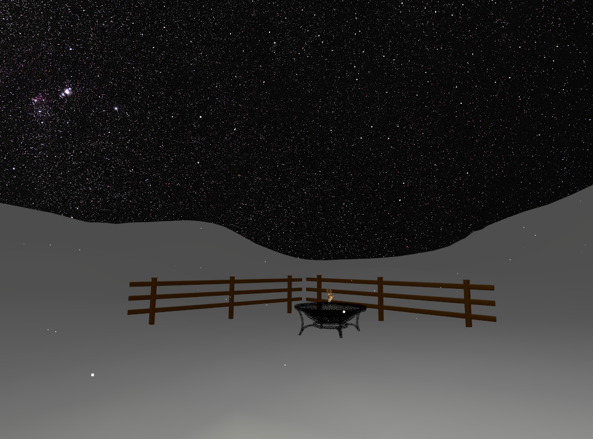

# OpenGL Project

This repository contains an OpenGL project I completed as part of my BSc in Applied Computing at the University of Dundee. 

Using OpenGL, I created a scene making use of various graphics techniques. A sky-box is used to represent the background view of the scene. 3D models were then loaded using their normals, uv coordinates, and vertices. A particle system was used to generate snowfall, this could be controlled to alter the speed and spread. A sprite sheet was used to create a burning fire effect. Camera adjustment was also added to allow rotation and movement within the scene. 

